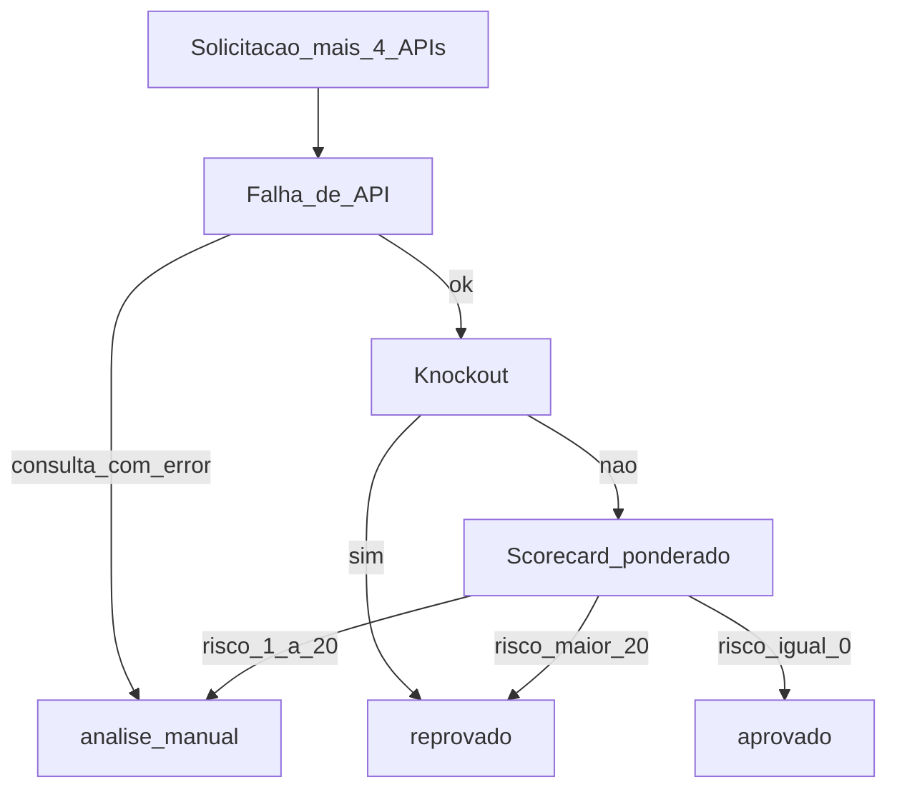

# Agente de avaliação — troca de titularidade (Liora)

Agente em Python que lê solicitações de troca de titularidade, consulta as APIs de apoio e decide entre `aprovado`, `reprovado` e `analise_manual` com um scorecard de crédito (knockouts + soma ponderada). Não é um modelo treinado.

Documentação da API: [https://liora-credit-flow.lovable.app/docs](https://liora-credit-flow.lovable.app/docs)

## Como rodar

Requisito: Python 3.10+ (desenvolvido em 3.14) com as dependências de `requirements.txt`.

```bash
pip install -r requirements.txt
```

Crie um `.env` na raiz (não commitar) com:

```
TOKEN_API=
BASE_URL=https://liora-credit-flow.lovable.app/api/public/v1
LIMIT=200
```

`TOKEN_API` é o Bearer pessoal do desafio. Todas as requisições usam `Authorization: Bearer <TOKEN_API>`.

```bash
python main.py
```

No Windows, se `python` não for o interpretador certo:

```bash
C:/Users/Eduardo/AppData/Local/Programs/Python/Python314/python.exe main.py
```

## O que já funciona

O `main.py` lista e consulta as solicitações. A decisão fica em `avaliar_solicitacao(solicitacao, consultas)` e já devolve o payload pronto para `POST /avaliacoes`. O loop principal **ainda não chama** essa função e **ainda não envia** o POST.

Hoje o fluxo:

1. Lista solicitações em `GET /solicitacoes` com paginação (`limit` do `.env`, `offset` até `pagination.total`).
2. Para cada solicitação, consulta as quatro APIs de apoio:
   - `GET /instalacao/{uc}/debitos` — até 3 tentativas em 503, respeitando `retry_after` / `Retry-After`
   - `GET /endereco/validar`
   - `GET /telefone/validar`
   - `GET /cpf/blacklist`
3. Se uma consulta falhar, grava `{"error": "..."}` e segue (`_consulta_segura`).
4. Acumula o resultado em memória e imprime `{solicitacao_id} consultada`.

A massa da documentação fala em 1000 cenários (`SOL-2026-001` a `SOL-2026-1000`). A API devolve `total: 999` (último id `SOL-2026-999`); isso não é bug de paginação.

## Regras de decisão

Cada ponto aplicável gera um subscore `s` em `[0, 1]` (`1` = ok). Critérios que não se aplicam (locação em imóvel próprio, vínculo PJ em PF) saem do cálculo e os pesos restantes são renormalizados para somar 100.

```text
score_risco = Σ w_i * (1 - s_i)     # 0 = nenhum risco, 100 = máximo
```

`score_risco` no payload segue o nome do campo: **quanto maior, pior**. Knockout envia `100`.



### Camada 0 — falha de API

Se qualquer consulta necessária vier com `{"error": "..."}` (incluindo 503 de débitos após 3 tentativas), a decisão é `analise_manual` e `score_risco = 0`. A falha isolada **não** vira `s = 0` e **não** gera reprovação automática. A justificativa cita qual consulta falhou.

### Camada 1 — knockouts (reprovado imediato)

Se qualquer um disparar, a decisão é `reprovado` com `score_risco = 100`, sem calcular o scorecard.

- Blacklist `true`
- CPF/CNPJ com dígito verificador inválido (CPF para PF, CNPJ para PJ)
- Telefone VoIP `voip == true`
- Corte programado `corte_programado == true`
- Menor de 18 anos (PF com `data_nascimento`)
- Imóvel alugado (`tipo_imovel` em `alugado` / `locado` / `aluguel`, case-insensitive) sem contrato vigente, com vencimento no passado, ou sem data de vencimento

Endereço inválido e débitos elevados **não** são knockout: entram no scorecard.

### Camada 2 — pontos de observação e pesos

Pesos em pontos (base 100). `s` é o quanto aquele ponto passa.

| Ponto | Peso | Subscore `s` |
| --- | --- | --- |
| Endereço | 22 | `1` se `valido` e `cep_consistente`. `0.4` se `valido == false` e existe `cep_correto_sugerido`. `0` se inválido sem sugestão |
| Débitos da UC | 22 | `1` se `status == regular`, total 0, sem faturas em atraso e sem histórico. `0.6` se só `historico_inadimplencia`. `0.3` se `faturas_em_atraso > 0` e total `<= 300`. `0` nos demais casos (`status != regular` ou total `> 300`). Corte programado já é knockout |
| Telefone | 18 | VoIP é knockout (este peso não entra nesse caso). Caso contrário `s = 1 - fraude_score/100`. Sem `fraude_score`, `s = 0` |
| Recência da conta de luz | 15 | `1` se `conta_luz_emissao` nos últimos 60 dias; `0.5` se 61–120; `0` se `> 120` ou data ausente |
| Contrato de locação | 13 (só alugado) | Próprio: N/A (renormaliza). Vigente e `>= 6` meses restantes: `1`. Vigente e `< 6` meses: `0.5`. Vencido / sem vigência: knockout |
| Vínculo empresa | 10 (só PJ) | PF: N/A. PJ com `vinculo_empresa` verdadeiro: `1`. PJ sem vínculo: `0` |

### Camada 3 — cortes da decisão

Depois das falhas de API e dos knockouts:

- `score_risco == 0` (todos os `s` aplicáveis = 1) → `aprovado`
- `0 < score_risco <= 20` → `analise_manual` (falha leve/isolada: conta com ~90 dias, histórico de inadimplência, PJ sem vínculo)
- `score_risco > 20` → `reprovado` (uma falha pesada ou várias leves somadas)

Exemplos sem knockout (pesos ainda sem renormalizar; no código os N/A são redistribuídos):

- só recência estourada (15) → manual
- só PJ sem vínculo (10) → manual
- só histórico de inadimplência (`22 * 0.4 = 8.8`) → manual
- débitos `s = 0` (22) → reprovado
- recência + PJ sem vínculo (25) → reprovado

## Payload de avaliação (ainda não enviado)

`avaliar_solicitacao` já monta o corpo esperado pelo `POST /avaliacoes`:

- `solicitacao_id` e `cpf_cnpj`
- `decisao`: `aprovado` \| `reprovado` \| `analise_manual`
- `score_risco`: valor do scorecard (knockout → 100; falha de API → 0)
- `verificacoes`: um status por ponto (`aprovado` / `reprovado` / `analise_manual` / `nao_aplicavel`)
- `justificativa`: em português, citando knockout, critérios com `s < 1` ou consulta que falhou
- `agente_versao`: `v1.0.0-scorecard`

O endpoint é idempotente por token + `solicitacao_id`.

Cada chave de `verificacoes` reflete o critério isolado, não a decisão final: `reprovado` se aquele ponto seria knockout ou `s = 0`; `analise_manual` se a consulta daquele ponto falhou; `nao_aplicavel` para contrato/vínculo quando não cabem; `aprovado` nos demais casos.

## O que falta

- Chamar `avaliar_solicitacao` no loop principal
- Enviar `POST /avaliacoes` com o payload montado
